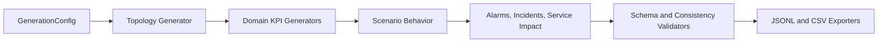

# Architecture

I kept the architecture deliberately simple. This is a synthetic data generator, not a full OSS stack or network simulator.

At a high level, the flow looks like this:

## Main Pieces

- `app.schemas`: Pydantic v2 models for topology, KPIs, alarms, incidents, service impact, and validation reports.
- `app.generators`: deterministic generation for topology, KPIs, alarms, incidents, and service impact.
- `app.scenarios`: the scenario definitions and the language used for symptoms and remediation.
- `app.validators`: checks for schema correctness, topology references, timestamp ordering, synthetic flags, and expected scenario behavior.
- `app.exporters`: JSONL and CSV output.
- `app.ui`: a small FastAPI/Jinja UI for generating and previewing datasets locally.

## Design Choices

The main design choice was to make the output easy to understand and validate. I did not want a black-box simulator where it is hard to explain why a metric changed.

The generator uses deterministic seeds, stable IDs, and scenario-specific KPI shifts. That makes it useful for tests, screenshots, blog snippets, and AI-agent evaluation.

I also kept the UI lightweight. There is no database and no heavy frontend framework. The CLI is the primary interface; the UI is there for quick local demos.

## Things I Skipped On Purpose

Parquet export is not implemented yet. JSONL and CSV are enough for the current MVP and keep dependency management simple.

I also skipped any real network integration, message bus, workflow engine, or standards claim. This repo is standards-inspired, not standards-certified.
